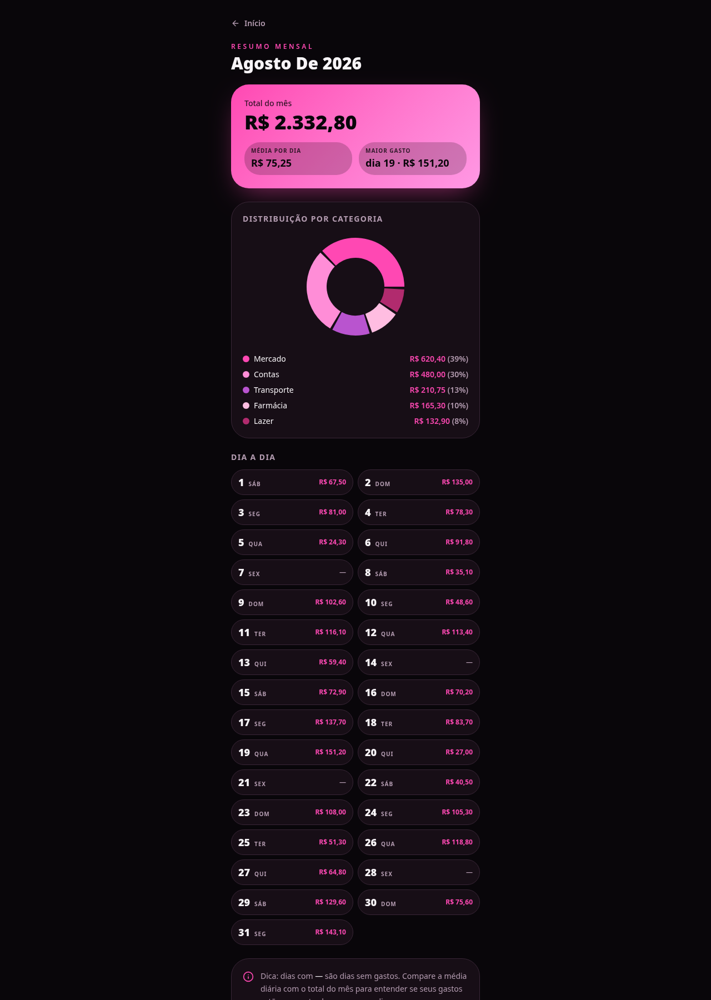

# Pink & Black Finance 💰
Aplicativo de Finanças Pessoais criado com Lovable — um projeto de vibe coding para organizar gastos diários e mensais de forma simples e visual.

---

## 🧠 Resumo do App
O **Pink & Black Finance** ajuda o usuário a registrar seus gastos diários, visualizar o total do mês e acompanhar a distribuição por categoria.  
A aplicação apresenta gráficos dinâmicos e comparativos mensais, permitindo entender melhor os hábitos de consumo e planejar o orçamento pessoal.

### Funcionalidades principais
- Registro de gastos diários por categoria (mercado, farmácia, transporte, contas, lazer).  
- Gráfico de pizza com atualização dinâmica conforme novos gastos são inseridos.  
- Fechamento automático do total diário às 23h59.  
- Comparativo mensal com gráfico de barras.  
- Tema alternativo preto + verde, remetendo à ideia de dinheiro.

---

## 🎨 Prints da Aplicação
Abaixo estão algumas telas geradas com Lovable durante o processo de criação:

---

## 💬 Reflexão sobre o processo

**O que funcionou bem:**  
A engenharia de prompts para otimização do processo e as interações com as ferramentas. O Lovable permitiu criar telas completas sem precisar programar, com excelente resultado visual.

**O que não funcionou como o esperado:**  
A gestão do tempo para utilizar novas ferramentas. Com um prazo curto, é importante iniciar o aprendizado antes para evitar atrasos e aproveitar melhor os créditos diários.

**O que aprendi sobre conversar com IAs:**  
Que são ótimas assistentes para projetos de tecnologia e aprendizado. A interação com a IA facilita a criação, organização e execução de ideias de forma prática e criativa.

---

## 🚀 Tecnologias e Ferramentas
- Lovable (versão gratuita)  
- GitHub para versionamento e documentação  
- Engenharia de prompts para geração de telas e layout  

---

## 📅 Status do Projeto
✅ MVP completo  
⚙️ Telas criadas e validadas  
🖼️ Layouts prontos para entrega  

---

## 📚 Autor
**Marcela** — Projeto de Finanças Pessoais com foco em vibe coding e aprendizado de IA.
